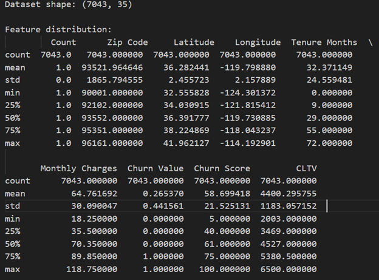
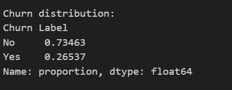
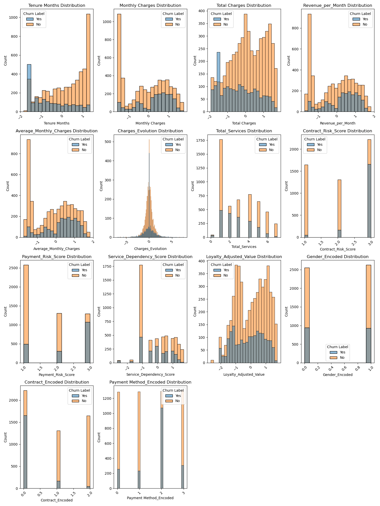
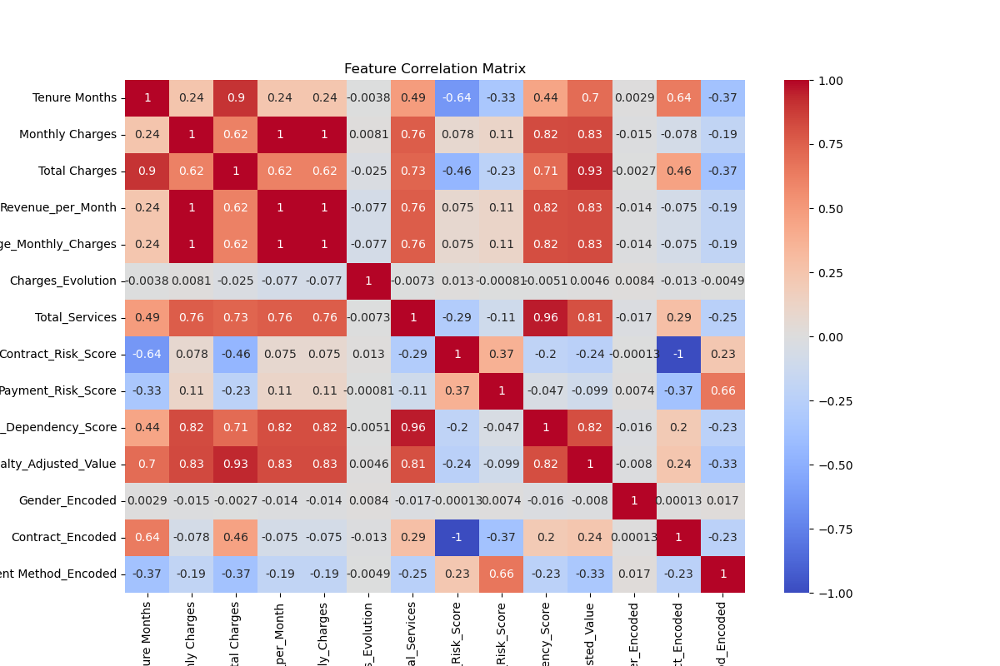
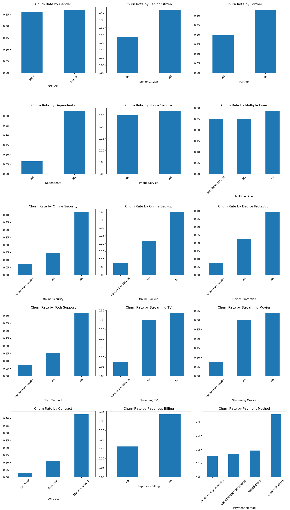
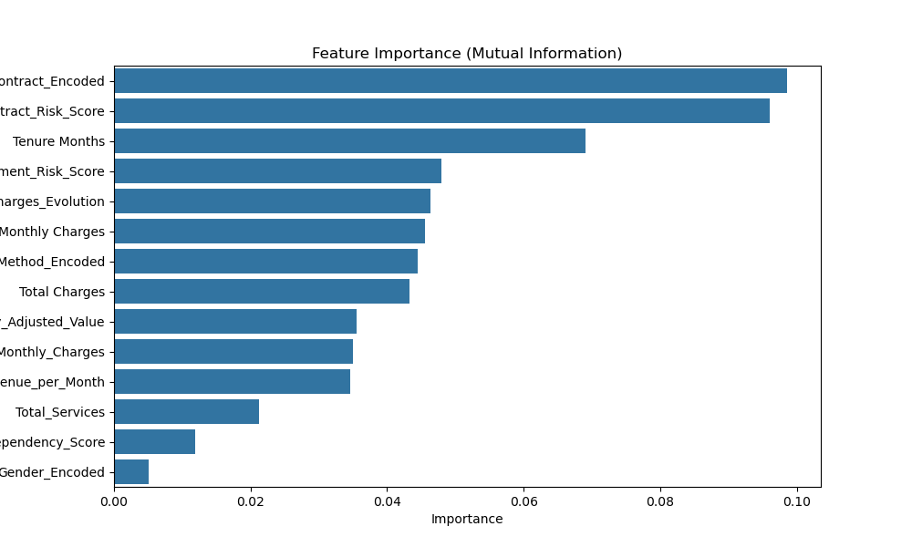
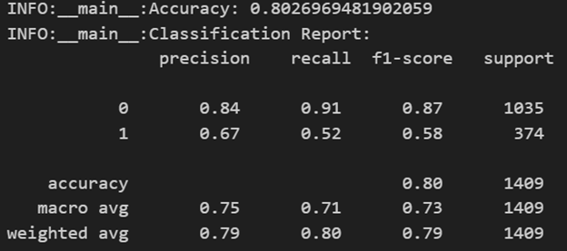

# Building a Customer Churn Early Warning System with Hugging Face and CircleCI

## Introduction

Customers retention is important for business success and growth. It can be costly to lose a customer to a competitor financially and in terms of reputation. Therefore, businesses need to anticipate when and why a customer might leave and implement measures to retain them. 

Customer service interactions provide valuable insight into customer sentiment. Combined with quantitative data, these interactions can help you uncover insights and predict potential churn. You can use machine learning (ML) techniques to build a system that analyzes both 
structured data and unstructured data to predict churn risk.

In this tutorial, you’ll learn how to build an automated customer churn prediction system using [Hugging Face Transformers]( https://huggingface.co/models) and [CircleCI]( https://circleci.com) pipeline for continuous integration and deployment (CI/CD). We will guide you through the process of combining traditional customer profile data with natural language processing (NLP) techniques to build an automated churn prediction system. 

By the end of this tutorial, you’ll have a fully functional system that integrates a **FastAPI** endpoint to generate predictions using the model. This will provide real-time insight to customer service agents as they handle customer calls.

Let’s get started on building a system that will help businesses retain their most valuable asset—their customers.


## Prerequisites

Before starting this tutorial, you should have:

- Python 3.8 or higher installed on your system
- Basic familiarity with AI/ML concepts
- A free [CircleCI account](https://circleci.com/signup/)
- A [Hugging Face account](https://huggingface.co/join)
- A [GitHub account](https://github.com/join)
- Docker installed on your local machine

If you're missing any of these prerequisites, take a moment to set them up using the links. You don't need to be an expert in any of these tools – this tutorial will guide you through each step of the process.

## Setting Up Your Customer Churn Prediction Environment

### Setup the development environment

Let's start by setting up a development environment. You need to define your project structure and examine the dataset that you will use to build the model. 

First, create a new directory for your project and set up a Python virtual environment and activating it.

```bash
mkdir churn-prediction
cd churn-prediction
python -m venv churn-pred
source churn-pred /bin/activate  # On Windows, use: churn-pred \Scripts\activate
```

Install initial dependencies:

```bash
pip install pandas numpy scikit-learn transformers sentence_transformers torch fastapi uvicorn boruta circleci
pip freeze > requirements.txt
```
Now that you have your environment set up and packages installed, you are ready to start building your churn prediction system. In the next section, you will explore the telco churn dataset to identify some patterns.

You can clone the repository on [GitHub](https://github.com/ArmstrongA/churn_prediction_app.git) to get started right away.

### Overview of the dataset (features, label distribution, and data characteristics)

The dataset is for a fictional telco company that provides phone and internet services to more than 7000 customers in California. In addition, we synthetically generated the phone conversation transcripts using the [GPT2](https://cdn.openai.com/research-covers/language-unsupervised/language_understanding_paper.pdf) algorithm.  

The dataset has 33 attributes(features) that include:
-	Gender – Whether the customer is male or female
-	Senior Citizen – whether the customer is 65+ or otherwise
-	Partner – Whether the customer has a partner
-	Dependents – Whether the customer has dependents 
-	Tenure Months – The Customer’s tenure with the company
-	Phone Service - the customer subscribes to home phone service
-	Multiple Lines - the customer subscribes to multiple phone lines with the company
-	Internet Service - the customer subscribes to Internet service
-	Conversation – The synthetic GPT-2 generated conversations of customer-agent ticket
-	Churn Label: the customer left the service or otherwise

Find more details on the attributes on [IBM Cognos Analytics]( https://community.ibm.com/community/user/businessanalytics/blogs/steven-macko/2019/07/11/telco-customer-churn-1113). 

Download the publicly available dataset from [GitHub](link). 

The `Conversation` column contains synthetic text generated using the GPT2 algorithm. The purpose is to show how you can apply this solution to real-world customer service support ticket/phone conversations. GPT2 is a powerful unsupervised transformer language model built by [OpenAI]( https://openai.com/). Refer to this [notebook](link) for more details on how we generated the conversations. 

Save the dataset in your current working directory and load it as follows:

```python
import pandas as pd
import numpy as np
from sklearn.model_selection import train_test_split

# Load the dataset
df = pd.read_excel('Telco_customer_churn.xlsx')

### Initial exploration
print("Dataset shape:", df.shape)
print("\nFeature distribution:\n", df.describe())
print("\nMissing values:\n", df.isnull().sum())
```

Take a moment to examine the distribution of your target variable (churn):


```python
print("Churn distribution:")
print(df['Churn Label'].value_counts(normalize=True))
```


You will notice that the dataset is imbalanced (with 26.5% churners and 73.5% retained).



This is typical for churn prediction problems. Most customers do not churn, hence, you should mind class imbalance when building your model.

In the next section, you'll learn how to preprocess this data and engineer meaningful features that will help your model identify potential churners. 


## Preparing and Analyzing Customer Churn Data

Now that you have loaded your data, it is time to prepare it for analysis. Data preparation is crucial exercise. Even the most sophisticated ML model can crumble under poor quality data input. You need to clean your data and create important features that will help you build a model to identify potential churners. 

### Data preprocessing
Start by creating a python script named `data_preprocessing.py` for cleaning and preprocessing your data:

```python
# data_preprocessing.py
import pandas as pd
import numpy as np
from sklearn.preprocessing import LabelEncoder, StandardScaler, PowerTransformer
from sklearn.impute import SimpleImputer
import logging

# Set up logging
logging.basicConfig(level=logging.INFO)
logger = logging.getLogger(__name__)

class DataPreparation:
    def __init__(self):
        self.label_encoders = {}
        self.scaler = StandardScaler()
        self.power_transformer = PowerTransformer()
        self.imputer = SimpleImputer(strategy='median')
        
    def load_data(self, file_path):
        """Load and validate the dataset."""
        try:
            #df = pd.read_csv(file_path)
            df = pd.read_csv(file_path)
            
            logger.info(f"Successfully loaded dataset with shape: {df.shape}")
            return df
        except Exception as e:
            logger.error(f"Error loading data: {e}")
            raise
            
    def validate_data(self, df):
        """Perform basic data validation checks."""
        validation_report = {
            'missing_values': df.isnull().sum().to_dict(),
            'duplicates': df.duplicated().sum(),
            'data_types': df.dtypes.to_dict()
        }
        
        # Check for invalid values in important columns
        if 'Monthly Charges' in df.columns:
            validation_report['negative_charges'] = (df['Monthly Charges'] < 0).sum()
            
        if 'Tenure Months' in df.columns:
            validation_report['invalid_tenure'] = (df['Tenure Months'] < 0).sum()
            
        logger.info("Data validation completed")
        return validation_report
```

### Feature engineering

The purpose of the script `data_preprocessing.py` is to show how you can develop your own custom feature transformation pipeline. The data transformations will depend on your specific use case and the nature of your dataset. You can make it as complex or as simple as you want. For example, depending on the nature of your dataset and the results of the exploratory data analysis, you may want to consider normalization, log transformation, or dropping null values. For a comprehensive list of feature transformation techniques, visit [SKLearn Dataset Transformations](https://scikit-learn.org/stable/data_transforms.html). 


In the `data_preprocessing.py` you can create new features that capture key patterns in customer behavior. The code below shows how you engineer features. 

```python
def engineer_basic_features(self, df):
        """Create basic derived features."""
        df = df.copy()
        # drop unecessary columns
        df = df.drop(['CustomerID', 'Count', 'Country', 'State', 'City', 
                    'Zip Code', 'Lat Long' 'Latitude', 'Longitude', 'Churn Value', 'Churn Score',    'CLTV', 'Churn Reason'], axis=1)

        
        # Customer value features
        df['Total Charges'] = pd.to_numeric(df['Total Charges'], errors='coerce')
        df['Revenue_per_Month'] = df['Total Charges'] / df['Tenure Months']
        df['Average_Monthly_Charges'] = df['Total Charges'] / df['Tenure Months']
        df['Charges_Evolution'] = df['Monthly Charges'] - df['Average_Monthly_Charges']
        
        # Service usage features
        service_columns = ['Phone Service', 'Internet Service', 'Online Security',
                          'Online Backup', 'Device Protection', 'Tech Support',
                          'Streaming TV', 'Streaming Movies']
        
        df['Total_Services'] = df[service_columns].apply(
            lambda x: x.str.count('Yes').sum() if x.dtype == 'object' else x.sum(), axis=1
        )
        
        # Customer segments
        df['Value_Segment'] = pd.qcut(df['Monthly Charges'], q=4, 
                                    labels=['Low', 'Medium', 'High', 'Premium'])
        
        return df
    
    def engineer_advanced_features(self, df):
        """Create more sophisticated features."""
        df = df.copy()
        
        # Contract risk score
        contract_risk = {'Month-to-month': 3, 'One year': 2, 'Two year': 1}
        df['Contract_Risk_Score'] = df['Contract'].map(contract_risk)
        
        # Payment reliability
        payment_risk = {
            'Electronic check': 3,
            'Mailed check': 2,
            'Bank transfer (automatic)': 1,
            'Credit card (automatic)': 1
        }
        df['Payment_Risk_Score'] = df['Payment Method'].map(payment_risk)
        
        # Service dependency score
        service_weights = {
            'Phone Service': 1,
            'Internet Service': 2,
            'Online Security': 0.5,
            'Online Backup': 0.5,
            'Device Protection': 0.5,
            'Tech Support': 0.5,
            'Streaming TV': 1,
            'Streaming Movies': 1
        }
        
        df['Service_Dependency_Score'] = sum(
            (df[service] == 'Yes').astype(int) * weight
            for service, weight in service_weights.items()
        )
        
        # Loyalty-adjusted value
        df['Loyalty_Adjusted_Value'] = (
            df['Monthly Charges'] * np.log1p(df['Tenure Months'])
        )
        
        return df
    
    def encode_categorical_features(self, df):
        """Encode categorical variables with proper handling."""
        df = df.copy()
        
        # Features for label encoding
        label_encode_cols = ['Gender', 'Contract', 'Payment Method']
        
        # Features for one-hot encoding
        onehot_cols = ['Internet Service', 'Value_Segment']
        
        # Label encoding
        for col in label_encode_cols:
            if col in df.columns:
                self.label_encoders[col] = LabelEncoder()
                df[f'{col}_Encoded'] = self.label_encoders[col].fit_transform(df[col])
        
        # One-hot encoding
        df = pd.get_dummies(df, columns=onehot_cols, prefix=onehot_cols)
        
        return df
    
    def scale_numerical_features(self, df):
        """Scale numerical features with proper handling of skewness."""
        df = df.copy()
        
        # Basic numerical features
        basic_num_cols = ['Monthly Charges', 'Total Charges', 'Tenure Months']
        
        # Derived numerical features
        derived_num_cols = ['Revenue_per_Month', 'Average_Monthly_Charges',
                          'Charges_Evolution', 'Service_Dependency_Score',
                          'Loyalty_Adjusted_Value']
        
        all_num_cols = [col for col in basic_num_cols + derived_num_cols 
                       if col in df.columns]
        
        # Handle missing values
        df[all_num_cols] = self.imputer.fit_transform(df[all_num_cols])
        
        # Apply power transform for heavily skewed features
        df[all_num_cols] = self.power_transformer.fit_transform(df[all_num_cols])
        
        # Standard scaling
        df[all_num_cols] = self.scaler.fit_transform(df[all_num_cols])
        
        return df

```

Feature engineering allows you to encode business insights into your model. For example:
-	Customer value features (`Revenue_per_Month`, `Average_Monthly_Charges, and `Charges_Evolution`)
-	Service usage (`Total_Services`)
-	Customer segments (`Value_Segment`) – grouped as low, medium, high, and premium
-	Contract risk score 
-	Payment reliability 
-	Service dependency score 
-	Loyalty-adjusted value


You can visualize features by running `feature_analysis.py`. 

The figure below shows the distribution of features:



The image shows distribution of numeric variables from tenure and monthly charges to contract risk scores and payment methods - with each metric split between churned (Yes) and retained (No) customers. Customers who eventually churn often show distinct behavioral patterns, such as higher monthly charges and lower tenure months.

You can visualize feature correlations as follows.



For categorical variables, customers with month-to-month contracts, electronic check payments, and no additional services (like online security or device protection) are more likely to churn.



You can get more information on the features using mutual information. Contract-related features such as `Contract_Encoded` and `Contract_Risk_Score` and `Tenure_Months` have high importance. On the other hand, demographic factors like `Gender_Encoded` demonstrate relatively lower predictive power.



### Basic modeling (training a baseline classifier)

Using customer profile features, you can train a baseline model. For this post you will use the `RandomForestClassifier`. We select features using the [boruta algorithm](https://doi.org/10.18637/jss.v036.i11). Implement hyperparameter tuning using `GridSearchCV`.
Build and run the model as follows:

```python
# import packages

import pandas as pd
import numpy as np
import joblib
from sklearn.model_selection import train_test_split, GridSearchCV
from sklearn.preprocessing import StandardScaler
from sklearn.ensemble import RandomForestClassifier
from sklearn.metrics import accuracy_score, classification_report
import logging
from feature_selection import FeatureSelector

# Setup logging
logging.basicConfig(level=logging.INFO)
logger = logging.getLogger(__name__)

# Load Data
df = pd.read_csv("processed_telco_data.csv")

# Feature Selection
selector = FeatureSelector(df)
selected_features, _ = selector.boruta_selection()  # Use boruta

# Prepare Data
X = df[selected_features]
y = df["Churn Label"].apply(lambda x: 1 if x == "Yes" else 0)  # Convert target to binary

# Train-Test Split
X_train, X_test, y_train, y_test = train_test_split(X, y, test_size=0.2, random_state=42, stratify=y)

# Scale Data
scaler = StandardScaler()
X_train_scaled = scaler.fit_transform(X_train)
X_test_scaled = scaler.transform(X_test)

# Save Scaler
joblib.dump(scaler, "scaler.pkl")

# Define Model
rf = RandomForestClassifier(random_state=42)

# Hyperparameter tuning
param_grid = {
    'n_estimators': [100, 200, 300],
    'max_depth': [10, 20, None],
    'min_samples_split': [2, 5, 10],
}

grid_search = GridSearchCV(rf, param_grid, cv=5, scoring='accuracy', n_jobs=-1)
grid_search.fit(X_train_scaled, y_train)

# Best Model
best_model = grid_search.best_estimator_
joblib.dump(best_model, "baseline_churn_model.pkl")

# Evaluate Model
y_pred = best_model.predict(X_test_scaled)
logger.info(f"Accuracy: {accuracy_score(y_test, y_pred)}")
logger.info(f"Classification Report:\n {classification_report(y_test, y_pred)}")

```
You should get this output from the model.



The baseline model has an accuracy of 0.80.

## Implementing Text Analysis with Hugging Face Transformers

This blog post leverages Huggingface to process unstructured text data in the context of agent-customer conversations.

### Set up HuggingFace’s transformers library and explain how users can access a wide range of pre-trained models

Getting started with Hugging Face’s `transformers` *library* is straightforward. Hugging face allows you to access models either at a higher-level pipeline or directly without the need of downloading an entire model.

One of the key strengths of Hugging `transformers` library is that you can access pre-trained models for various NLP tasks—including sentiment analysis, text classification, question answering, and more. You can access the models through `AutoModelForSequenceClassification` and `AutoTokenizer` classes. You can explore the available models on [Hugging Face model hub](https://huggingface.co/models). 

In the next section, you will learn how to load a pre-trained sentiment analysis model and apply it on the `customer_text` column to generate sentiments customers expressed in their conversation with the support agent. 

### Implement sentiment analysis for support tickets

You can easily analyze customer sentiments as follows:

```python
import pandas as pd
from transformers import AutoTokenizer, AutoModelForSequenceClassification
import torch
import torch.nn.functional as F
from dotenv import load_dotenv

# Load model and tokenizer
tokenizer = AutoTokenizer.from_pretrained("distilbert/distilbert-base-uncased-finetuned-sst-2-english")
model = AutoModelForSequenceClassification.from_pretrained("distilbert/distilbert-base-uncased-finetuned-sst-2-english")

# Load the CSV file
df = pd.read_csv("./data/Telco_customer_churn_with_text.csv")  # adjust the path accordingly

def get_sentiment(text):
    inputs = tokenizer(text, return_tensors="pt")
    with torch.no_grad():
        outputs = model(**inputs)
    logits = outputs.logits
    probabilities = F.softmax(logits, dim=-1)
    predicted_class_id = logits.argmax().item()
    return model.config.id2label[predicted_class_id]

# Apply the sentiment analysis function to the 'customer_text' column
df['customer_sentiment'] = df['customer_text'].apply(get_sentiment)
```

The code in `sentiment_extractor.py` uses the powerful `transformers` library to load two essential components: 

- `AutoTokenizer` - converts text into an understable format for the model, and 
- `AutoModelForSequenceClassification` - making sentiment prediction. 

We are using [DistilBERT](https://huggingface.co/distilbert/distilbert-base-uncased-finetuned-sst-2-english) -- a faster, lighter version of BERT model for sentiment analysis. The `get_sentiment` function takes each customer's text, processes using PyTorch (`torch`), and returns a prediction of either positive or negative sentiment. The `df['customer_text'].apply(get_sentiment)` allows pandas to run the analysis on every single customer conversation in the dataframe.

### Transform text into embeddings

Text embeddings are numerical representations of text that have semantic meaning. Embeddings are important for performing tasks like similarity search and clustering. You can transform text into embeddings as follows:

think of them as converting words into lists of numbers that represent their meaning. For example, the sentences "I love pizza" and "I enjoy pizza" would have similar embedding values because they mean similar things. You can easily create embeddings using modern AI models like this:

### Build feature extractors using sentence transformers

[Hugging Face sentence transformers](https://huggingface.co/sentence-transformers) are handy for building feature extractors. You will use the sentence transformers to generate embeddings as inputs for the churn prediction task. The approach allows you to use the rich semantic information generated by the pre-trained model. This will improve model performance as compared to traditional feature engineering techniques. In this case you will use the [all-mpnet-base-v2](https://huggingface.co/sentence-transformers/all-mpnet-base-v2) model. 

The `all-mpnet-base-v2` sentence-transformers model maps the customer conversations text to a 768 dimensional dense vector space. and can be used for tasks like clustering or semantic search.

### Combine with structured features

You can combine the customer profile features with the text features as follows:


## Building your customer churn prediction system

### Design the risk scoring algorithm to predict customer churn

Now that the dataset is processed and ready to use, you can train any classifier model to predict if a customer will churn or not. Besides predicting the class (true/false) for customer churn, the model will also generate the probability of a customer churning. This is crucial for designing strategies for retaining a customer based on their likelihood of canceling the service. 

In this post, you will use the SKLearn RandomForestClassifier model. There are many hyperparameters to choose from. You will optimize the hyperparameters for a more accurate model prediction by using strategies like random search,  grid search, and Bayesian search.

Here is the model:

```python

```

### Create the main prediction pipeline 

After building and training the model, you save it as `baseline_churn_model.pkl`, you can access it for making predictions using the `prediction_pipeline.py`.

```python


````

Next, lets build a 


### Create a FastAPI endpoint for serving the model

FastAPI is one of the fastest way to deploy ML models, providing an easier way to implement data validation for specific data types. The `fastAPI` package needs a `uvicorn` server. You already installed these when you were setting up the project.

The first step is to define the format of the data that you will provide to the model to generate predictions. This is important because the model works with both numeric and text data. You want to feed the model with correct data.

Define the **request body** (data sent from the client side to the API) using `BaseModel`-- a *pydantic* module. 


The **response body** is the data sent from the API to the client. Here is the endpoint for predicting the churn class and returning the response.


Open the terminal and run 

```bash
uvicorn main:app --reload
```
Open `http://127.0.0.1:8000/docs` in your browser to test your API. This will open a Swagger UI and you will see the following output:


Click on **Try it Out** button and enter your data for prediction.


After entering the values click **Execute** and you will see the predictions under the response body section.

As you can see you got a class response and the probability. You have successfully deployed your ML mode as an API using FastAPI.


## Setting up CI/CD for churn prediction with CircleCI

### Create a CircleCI configuration (setup config.yml, add test automation, and build docker image)

Now that you have the application set up, it is time to create a CI/CD pipeline. The project structure 

### Implement the deployment pipeline


### Manage environments


## Deploying and Monitoring your customer churn system

### Write tests 

### Build images and test the container

### Implement deployment process

## Conclusion
○	Summarize what we built
○	Highlight key takeaways
○	Point readers to the next step
Call to Action to try CircleCI for free.
